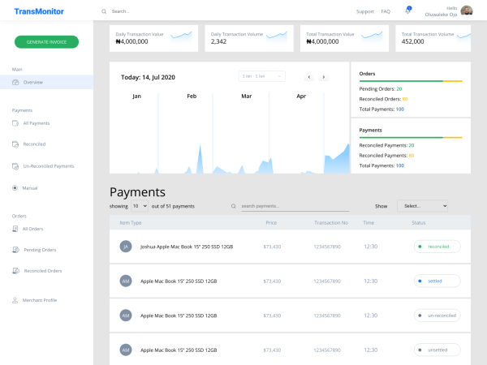
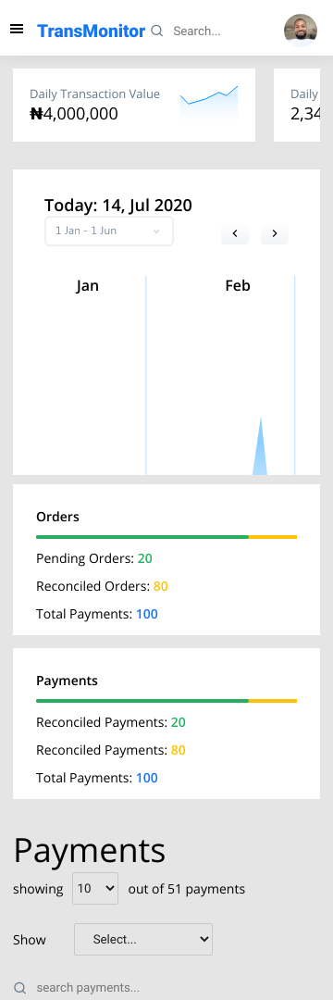

## TRANSMONITOR
[](https://app.netlify.com/sites/chrisjosh-transmonitor/deploys) 

<a href="https://www.netlify.com">
  
</a>

Site: [TransMonitor DashBoard](https://chrisjosh-transmonitor.netlify.app/)




Mock up build for the [BankWithMint](http://bankwithmint.com/) Frontend test. Powered by React. 

## Features
* Context
* Routers
* Paginations
* Sidebar Toggle
* Responsive Table
* Desktop and Mobile Responsive Layout

## Design Pattern
* Atomic Design Pattern

* Built with intent for production

## Running the Project
Run yarn install to download and update dependencies
```
yarn install
```

Start the development server
```
yarn start
```

Build and Optimise for Production
```
yarn run build
```
